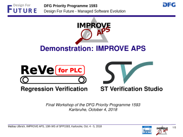
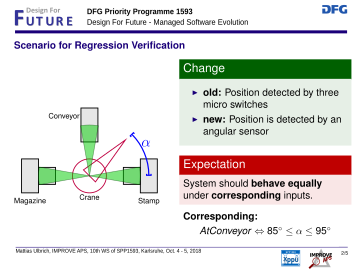

# Demonstration from the Final&nbsp;Workshop

To follow the demonstration, you should download the following archive,
including a version of [stvs](../stvs/),
[geteta](../geteta/), [rvt](../rvt/). Also consider to
download the model checker [nuXmv](http://nuxmv.fkb.eu), for running the
verification.

Introduction
------------

[](first_slide.svg)

Welcome to the demonstration of two tools implementing two approaches
developed in IMPROVE APS. They reflect the two side of formal analysis
of evolution of APS software: There are behavioural aspects that should
be retained. We use ReVe4PLC to show that this is the case. And there
are new behavioural apsects which need to be specified and verified. We
use our ST verification studio to do so.

Regression Verification
-----------------------

[](second_slide.svg)

Let’s start with an evolution scenario of the PPU (12 to 13 for the
insiders). Originally, the position of the crane was reported using 3
switches at the respective positions of the crane: magazine, conveyer,
stamp. Assume that this was too imprecise. The designers decided to
replace the sensors by a single angular sensor (a potentiometer).

Of course the software needed to be adapted for this hardware change as
the type of sensor values changed. (3 booleans vs. one integer).

When running the plant, the two plants should not be distinguishable. We
could run some tests to that this is so in these cases.

However, we want to cover all possible cases and therefore undergo a
static analysis of the code running the two systems and compare it. They
cannot be equivalent as they have different input signals.

Indeed, a relation on the inputs needs to be given which defines which
input values correspond for the two code revisions. Position C for
instance corresponds to the angle range between 87 and 93 degrees.
Likewise the others. Assuming this relation on the inputs, the code
revisions must produce the same output. That’s our verification goal.

Now let us look at the code to be verified.

> You can the source code here: [Scenario 12: Crane](Crane12.st),
> [Scenario 13: Crane](Crane13.st) and the [library
> function](library.st).

This is the crane model of the PPU implementation: an SFC with 63
states. Although not terribly complex, this is already a size at which
it is easy to miss a mistake.

The first step of our tool chain is to normalise this code to imperative
code in ST (500 loc).

The same can be done with the second revision of the code which is
similar – with some local changes.

```sh
#!/bin/sh

dist/bin/rvt                          \
    -L library.st                     \
    --old Crane12.st --old-name Crane \
    --new Crane13.st --new-name Crane \
    --miter UNTIL --until-miter-cond inputconstraint.smv \
    --do-not-verify

/usr/bin/time \
    /home/weigl/share/nuXmv-1.1.1-Linux/bin/nuXmv -source commands.xmv \
    main.stable.smv
```

Our regression verification tool is a command line tool. This is the
command to invoke it:

```sh
$ cd demo/rvt-aps && ./run.sh
```

We specify the two programs (rev. 12 and 13) and the relation for the
inputs to produce the input for the model checker.With that we invoke
the model checker (can be done in one call).

    *** This is nuXmv 1.1.1 (compiled on Wed Jun  1 10:18:42 2016)
    *** Copyright (c) 2014-2016, Fondazione Bruno Kessler
    [..]
    Number of bits: 333 (0 frozen, 33 input, 300 state)
    [..]
    -- no proof or counterexample found with bound 40
    -- invariant (__miter__.premise -> ((((((__miter__.inner.eq_MagazinVacuumOff_MagazinVacuumOff & __miter__.inner.eq_CraneTurnClockwise_CraneTurnClockwise) & __miter__.inner.eq_CraneLower_CraneLower) & __miter__.inner.eq_CraneTurnCounterclockwise_CraneTurnCounterclockwise) & __miter__.inner.eq_StartCommandCrane_StartCommandCrane) & __miter__.inner.eq_MagazinVacuumOn_MagazinVacuumOn) & __miter__.inner.eq_AnalogCranePressure_AnalogCranePressure))  is true

We use nuxmv, a state-of-the-art model checker, which is particularly
good at inferring invariants.

This will take a while.

We have verified the evolution scenarios of the original PPU using our
approach – with runtimes betwen a few minutes and several hours.

We have since extended our approach with a modularisation concept which
allows us to consider modules separately (like here the crane) which
shortens the verification time considerably.

In the reuslt, we can see that the invariant – which encodes the wanted
equivalence – is true. Hooray, the two programs are equivalent as
specified.

This is how we deal with behaviour which is to remain unchanged.

ST Verification Studio
----------------------

    $ java -jar stverificationstudio-all-1.4.0-beta.jar

It’s different when new behaviour is to be introduced. Here we need an
understandable specifciation language, and a verification system with
good user feedback.

As mentioned earlier in the presentation, we have invented generalised
test tables for precisely that reason.

Our implementation of a user-friendly system for such tables is the
Verificaiton Studio. On the left you can see the code that we are
operating on. On the right hand side, you can edit the table and you get
feedback on the verification effort.

In this demo, we will not look at a plant, but at a basic component as
often used in systems: A component which limits a value to a range given
by a minimum and a maximum value. Since gtts are good for specification,
I would like to explain their usage by means of such tables.

Test tables describe component runs over a number of clock cycles. They
do not describe individual runs, but families of similar runs, which are
parametrised.

Here we see a table, I is the input, an integer, and Q is the output.
This table describes a scenario in which the component is trained to its
minimum/maximum values p and q, and then run within these bounds.

At first, the system runs for a while, before initialisation, the output
is expected to be 0. Then we switch into learning mode, training the
values p and q and some values in between.

Then switching back to normal mode, if only values within \[p,q\] arrive
as inputs, they are replicated as outputs. No warning.

We can use this table as runtime monitor, to generate test cases or to
do formal verification. We can do this, pressing the button up there.

> Press VERIFY

The verification succeeds: Any instance of the generalised table is
satisfied by the implementation.

> Show second table: Warning

Another table for a different use case: Here the range \[o,q\] is
learned, but the input value violates this: A warning is expected.

However, verification reveals that the implementation does not satisfy
this case. We get shown a counterexample trace violating the table. Both
as values, and as a timing diagram.

Debugging reveals that the implementation is buggy. It initialises min
and max to 0 – if the values are negative, this makes the implementation
fail.

This concludes the demonstration of our two tools for verification in
evolution: regression verification and gtts.
