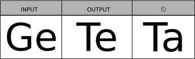

**Generalized Test Tables for the specification and verification of safety and
security properties in automation software.**

{: .center}


## Getting Started

Newer versions of geteta are bundled in the `verifaps-lib` repository. Old
version can be [downloaded below](#download-of-old-version). To build
`verifaps-lib` see [Getting Starting on the main page](/#getting-started).

The `geteta` module provides following programs

* [geteta](#program-geteta) -- Model-checking for gtt
* [geteta-smt](#program-geteta-smt) -- SMT-based for gtt via Eldarica or SeaHorn
* [reteta](#program-reteta) -- Model-checking for rtt
* [ttmonitor](#program-ttmonitor) -- Runtime Monitor generation
* [ttprint](#program-ttprint) -- printing of rtt/gtt into LaTeX or HTML
* [ttunwind](#program-ttunwind) -- generating a ODS (LibreOffice) table from
  a gtt and a program


# Program: `geteta`

The `getata` program provides the facilities for the verification of gtt against
the nuXmv model-checker, incl. the paraparations of debugging and diagnostics
information. Ensure, that you have installed [nuXmv](http://nuxmv.fbk.eu). You
need to set the `NUXMV` environment variable to the nuXmv executable.

```
export NUXMV=/home/weigl/work/nuXmv-1.1.1-Linux/bin/nuXmv
```

Usage of `geteta`:

```
Usage: geteta [OPTIONS]

options for handling programs:
  -L, --library PATH          Library files to include in the namespace
  -P, -c, --program PATH      File containing the main program
  --no-simplify / --simplify  Disable the simplification to ST0

Options:
  -T VALUE                         setting a time constant
  -t, --table FILE                 test table file
  --select-table TABLE_NAME        specify table by name, which should be used
                                   from the given file
  --meshed / -M                    enable experimental meshed tables
  -o, --output TEXT                Output directory
  --model-check / --dont-model-check, --dry-run
                                   the model checker is invoked when set
                                   [default:true]
  --nuxmv TEXT                     Path to nuXmv binary. You can also set the
                                   environment variable $NUXMV
  --cexjson                        exports an analysis of the counter example
                                   in json
  --row-map / --no-row-map         print out a mapping between table rows and
                                   states
  --ods PATH                       generate ods counter-example file
  --ods-open
  --cexout                         prints an analyis of the counter example
                                   and the program
  --debug-automaton                generate a dot file, showing the generated
                                   automaton
  --show-automaton                 run dot and show the image of the automaton
  -m, --mode VALUE                 verification mode
  -h, --help                       Show this message and exit
```

### Example

You find examples for geteta in `geteta/examples/` folder. 
For example with: 

```
cd Counter && geteta  -t OneIncrement.gtt -c OneIncrement.st
```

you verify the simple counter example with nuXmv and IC3.
If you want to view the generated automaton, you specify `--print-automaton`:

```
cd Counter && geteta --print-automaton  -t OneIncrement.gtt -c OneIncrement.st
```

`geteta` also provides with sophisticated preprataions of the counter-example
when a verification attempt failes. For example, with 

```
cd constantprogram && geteta --row-map  --cexout -t constantprogram_broken.gtt -c constantprogram.st
```

`geteta` maps between each state in the counter-example to a table row
(`--row-map`). Note, there might be multiple possible row mappings. By
`--cexout`, `geteta` writes a text file, containing the state of the program and
the test table for each cycle. The state of the program also includes the value
of every variable at each assignment and whether branches are taken. The table
state includes the current active table rows, and the violation or satisfication
of assumption and assertions.


## Program: `geteta-smt`


## Program: `reteta`

The program `reteta` provides support for model-checking of relational test
tables. These are test tables which descirbes properties over multiple program
runs of different (or the same) programs.

```
Usage: reteta [OPTIONS]

options for handling programs:
  -L, --library PATH          Library files to include in the namespace
  -P, -c, --program TEXT      File containing the main program
  --no-simplify / --simplify  Disable the simplification to ST0

Options:
  --verbose                        enable detailed output message
  --version                        show current version
  -T VALUE                         setting a time constant
  -t, --table FILE                 test table file
  --select-table TABLE_NAME        specify table by name, which should be used
                                   from the given file
  --meshed / -M                    enable experimental meshed tables
  -o, --output TEXT                Output directory
  --nuxmv TEXT                     Path to nuXmv binary. You can also set the
                                   environment variable $NUXMV
  --model-check / --dont-model-check, --dry-run
                                   the model checker is invoked when set
                                   [default:true]
  --debug-automaton                generate a dot file, showing the generated
                                   automaton
  --show-automaton                 run dot and show the image of the automaton
  --print-augmented-programs       prints the augmented programs into files:
                                   <name>.st
  -h, --help                       Show this message and exit
```

### Examples 

* TODO from formalise-20 paper
 
## Program: `ttmonitor`

**Generation of runtime monitors for C++**

```
Usage: ttmonitor [OPTIONS]

  Construction of monitors from test tables for Runtime Verification

Options:
  -T VALUE                         setting a time constant
  -t, --table FILE                 test table file
  --select-table TABLE_NAME        specify table by name, which should be used
                                   from the given file
  --meshed / -M                    enable experimental meshed tables
  -o, --output PATH                destination of the output file
  --write-header / --dont-write-header
                                   Write the 'monitor.h' header file.
  -f, --format VALUE               code format, possible values: CPP
  --disable-combined / --combined  Generate a combined monitored or single
                                   monitors of given tables
  -I TEXT                          give header files to be included
  -h, --help                       Show this message and exit
```

## Examples

The typical call of `ttmonitor`` is: 

```sh
$ ttmonitor -t table.tt -I yoursystemheader.hpp
```

It will generate a monitor (C++ files) for every test table given in the given
test table file as `<output>.hpp` with an include directive
`"yoursystemheader.hpp"`. 


## Program: `ttprint`

printing of rtt/gtt into LaTeX or HTML

```
Usage: ttprint [OPTIONS] [FILE]...

  generate print files for rtt/gtt

Options:
  -f, --format VALUE
  --output FILE       Print output to the given file.
  --standalone        Standalone version (include preamble/postamble)
  -h, --help          Show this message and exit

Arguments:
  FILE  test table
```

## Program `ttcsv`

A program that transforms CSV files into test table files.

```
Usage: ttcsv [OPTIONS] [FILE]...

Options:
  -o FILE     output table file
  -q TEXT
  -d TEXT
  -h, --help  Show this message and exit

Arguments:
  FILE  CSV files

ttcsv -- Generate table template from csv files.
```


## Program `ttunwind`

UnwindODS -- Tooling for Relational Test Tables.

```
Usage: tt-debug.sh [OPTIONS] [table]...

Options:
  -o, --output PATH   Output ODS file
  -L, --library PATH  ST code to be weaved in
  -p, --program PATH  ST code to be weaved in
  --name TEXT         Name of Program or function block
  -h, --help          Show this message and exit

Arguments:
  table  the xml file of the table

```

## Program `ttcov`

`ttcov` computes the program coverage of a test table.


```
Usage: ttcov [OPTIONS]

options for handling programs:
  -L, --library PATH          Library files to include in the namespace
  -P, -c, --program TEXT      File containing the main program
  --no-simplify / --simplify  Disable the simplification to ST0

Options:
  --verbose                  enable detailed output message
  --version                  show current version
  -T VALUE                   setting a time constant
  -t, --table FILE           test table file
  --select-table TABLE_NAME  specify table by name, which should be used from
                             the given file
  --meshed / -M              enable experimental meshed tables
  --run-smt
  -o, --output TEXT          Output directory
  -h, --help                 Show this message and exit

```

## Download of old version

These are jar files include all dependencies:

-   0.5.0-SNAPSHOT: **not released**
    -   new automata model
    -   different verification techniques (IC3, BMC, LTL)
    -   **latest useable version for [stvs](/stvs/index.md)**
-   0.4.4: [geteta-0.4.4-exe.jar](downloads/geteta-0.4.4-exe.jar)
    -   Fix a bug in the clocks.
-   0.4.3: [geteta-0.4.3-exe.jar](downloads/geteta-0.4.3-exe.jar)
    -   Change clock initial value to 1 as off-by-one error
-   0.4.2: [geteta-0.4.2-exe.jar](downloads/geteta-0.4.2-exe.jar)
    -   Kills nuXmv, if geteta is killed
    -   depends on new version of `iec61131lang`
-   0.4.1: [geteta-0.4.1-exe.jar](downloads/geteta-0.4.1-exe.jar)
    -   bug fixes: missing constraint on free variables are treated as
        don’t cares
-   If a free variable is an enum, every allowed enum literal is allowed
    (super-enum to rule them all).
    -   0.4.0: [geteta-0.4.0-exe.jar](downloads/geteta-0.4.0-exe.jar)
-   Counter examples in the semantic of traces in the test table
    -   0.3.0: [geteta-0.3.0-exe.jar](downloads/geteta-0.3.0-exe.jar)
-   enum support tested and fixed
    -   0.2.2-beta:
        [geteta-0.2.2-beta.jar](downloads/geteta-0.2.2-beta.jar)
-   better nuxmv output parser
    -   0.2.1-beta:
        [geteta-0.2.1-beta.jar](downloads/geteta-0.2.1-beta.jar)
-   Internal changes
    -   0.2.0: [geteta-0.2.0.jar](downloads/geteta-0.2.0.jar)


# A DSL for Test Tables 

In this section we describe the input language for defining gtts and rtts. As
writing a table-shaped input mechnnism is quite cumbersome and error prone, we
decided for a concise textual representation, that can understand and written by
human or used as an input language for other tools.

The test table language is valid for all test table tools.

## Structure

A test table file consists out of multiple `table` declaration:

```
table <NAME> { <BODY> }

relational table(a,b,c, ... ) { <BODY> }
```

A table declaration has a name (for identification) and a body. Additionally,
rtts are defined with the modifier `relational` and a finite list of names of
the program runs `(a,b,c)`.

The body `<BODY>` contains different elements

* An inheritance clause `\inherit_from <TABLE-NAME>`. With this directive, you
  inerhit the variable definition from a different table given by `<TABLE-NAME>`
  into the current test table.
  
* Definition of variables inside the test table:

  - Program variables for gtts
  
    ```
    var {next|assume|assert|output|input|state}* <NAME> [as <NAME>] : <DATATYPE>
    ``` 
    declares a new  program variable `<NAME>` as an input, output or state variable.
    
    A state variable can also be evaluatd in the current or "next" state (the
    state after computation) and can be considered as an assumption (`assume`) or
    an assertion (`assert`). The output modifier is a short cut for `state assert
    next` and the input is for `assume`.
    
    Note, that the you the `<NAME> [as <NEW-NAME>]` can be repeated (separation
    with comma `,`), then for variable access inside the model-checker `<NAME>` is
    used, and this variable can be access under `<NEW-NAME>` in the test table.
    This is useful, if the program variable names are long, or to get a little bit
    of abstraction from the concrete names, or if you need to access the same
    state variable in the current and next state.
  
    The data type can any name of a built-in IEC 61131 or `ENUM`. 
    
    For using `ttmonitor`, you can also use `ENUM_<NAME>` which is translated into
    `<NAME>` in the C++ output.
  
    The name of the variable have to correspond to the variable names in the
    simplified version. Therefore, to access a field `f` in a struct `s`, you
    write `s$f`.
  
  - Program variables for rtts
  
    The variable declaration for rtts need to contain the program run:
  
    ```
    var {next|assume|assert|output|input|state}* <FQNAME> [as <NAME>] : <DATATYPE>
    ``` 
    
    where `<FQNAME>` is a fully qualified name, e.g. `a|>v`, `a·v`, `a::v` for
    program run `a` and program variable `v`.
    
    As program variables have often the same name across multiple runs, there
    exists a shorter version.
    
    ``` 
    var {next|assume|assert|output|input|state}* 
        "{" a,b,c, ...  "}" <NAME> {, <NAME>} : <DATATYPE>
    ```
  
    declares the given `<NAME>`s in the given program runs `a,b,c...` given in
    curly braces.
  
  * Global variables
  
    Global variables can be specified in a similar fashion, allowing an
    additional initial constraint.
  
    ```
    gvar <NAME> : <DATATYPE> [with constraint=<EXPR>]
    ``` 

  - Columns allow projection of values
  
    ```
    COLUMN var_modifier name=IDENTIFIER (COLON dt=IDENTIFIER)? AS expr (COMMA expr)*
    ```


  - Time constant
  
    Time constant are rigid value, which are fixed at parsing time of a table.
    This restriction allows their use in time constraint. Time constant can be
    given on the command line with `-T <name>:<value>`. To define a time constant
    with a name and a default value use:q
 
    ```
    tconst <NAME> : <DEFAULT>
    ```
    
* Options can be set using the `options` clause, where the body is a list of key
  value pairs:
  
  ```
  options {
    key.subkey: value1
    otherkey.next: value2
  }
  ```
  
  This clause is optional.
  
* The main part of a test table is given a the root `group`. This clause is the
  recursive part of the definition. There are two clauses: `row` represent a row
  and `group` representing a row group. Both have similar headers
  
  ```
  group [<NAME>] [<TIMECNSTR>] {
    ...
  }
  ```

  ```
  row [<NAME>] [<TIMECNSTR>] {
    ...
  }
  ```
  
  `<NAME>` is optional and is the identifier of the element (useful for
  debugging) and `<TIMECNSTR>` is a duration constraint. If the identifier is
  ommitted, the row gets assigned a generated value. The row and group
  identifiers have to be unique. Omitted duration constraints are treated as
  singleton `[1,1]`.
  
  The body of group are group clauses or row clauses. The body of a row clause is 
  a list of column to value pairs:
  
  ```
  row [<NAME>] [<TIMECNSTR>] {
    <COLUMN1> : <EXPR1>
    <COLUMN2> : <EXPR2>
    <COLUMN3> : <EXPR3>
  }
  ```
  
  `<COLUMN>` is either the name of a program variable, or the fully-qualified
  name (`FQ_NAME`) or the name of declared column. If you omit column in a row,
  the cell content in this row is the same in the row above. So you only to
  specify the changes from row to row.
  
  Rows in rtts can also contains *control commands* written as 
  ```
  \pause : <RUNS>
  \play : <RUNS>
  \backward(<ROWID>) : <RUNS>
  ```
  where `<ROWID>` is the identifer of a row and `<RUNS>` are comma-separated
  lists of names of program runs.

  
* At the end of a table you can mention additional functions using the IEC 61131
  grammar. For example `MIN(a,b)`:
  
  ```pascal
  FUNCTION MIN : INT 
  VAR_INPUT a,b:INT; END_VAR 
  IF a<b THEN MIN:=a; ELSE MIN:=b END_IF
  END_FUNCTION
  ```
  
  
## Cell Content 

A cell content is either comma-separated list of following elements:

* dont-care (i.e. `-`)
* a variable name (e.g. `Q`, `in`, `Mode`)
* a constant (e.g. `1`, `TEACH`, `TRUE`)
* a singlesided expression (e.g. `<5`, `>=0`)
* an interval (e.g. `[1,x]`, `[x/2,x*2]`) , or
* an expression.

An expression is constructed inductively defined:

Every literal (`TRUE`, `FALSE`, integers, enum values), variables, or past reference 
is an expression, which can be combined by following operators:

* unary minus (`- <EXPR>`)
* logic negation (`NOT <EXPR>`)
* parenthesis (`(<EXPR>)`)
* point arithmetic: division (`<EXPR> / <EXPR>`), modulo (`<EXPR> % <EXPR>`),
  multiplication (`<EXPR> * <EXPR>`)
* line arithmetic: addition (`<EXPR> + <EXPR>`), substraction (`<EXPR> - <EXPR>`),
  multiplication (`<EXPR> * <EXPR>`)
* comparison (`<EXPR> < <EXPR>`), (`<EXPR> <= <EXPR>`),
 (`<EXPR> > <EXPR>`),  (`<EXPR> >= <EXPR>`)
* equalities (`<EXPR> = <EXPR>`),  (`<EXPR> <> <EXPR>`)
* logical junctions  (`<EXPR> AND <EXPR>`),  (`<EXPR> OR <EXPR>`) 
(`<EXPR> XOR <EXPR>`) 
* switch-expression (`if :: a -> 2+q :: true -> 1 fi`)
* Function calls (`SEL(a, 2+q, 1)`)
