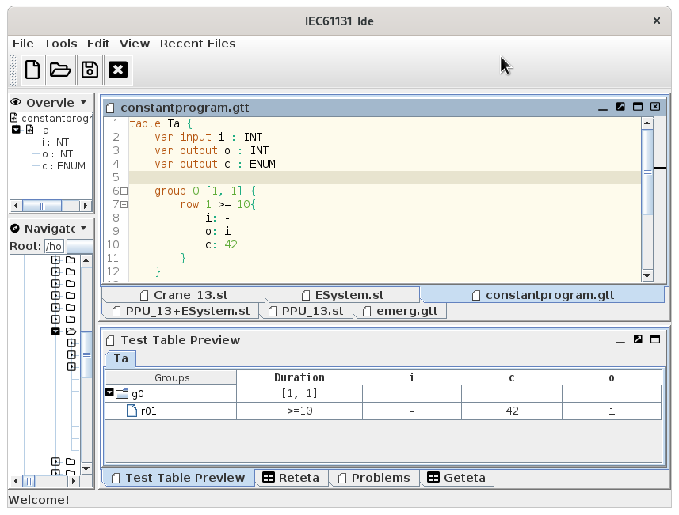

# Features

* [x] Syntax highlightning
* [x] Linting support (IEC 61131 only)
* [ ] Tool Integration
* [x] Test Table Preview
 
# Getting Started

The editor is available [after build of verifaps](/#getting-started) under
program `ide`.

